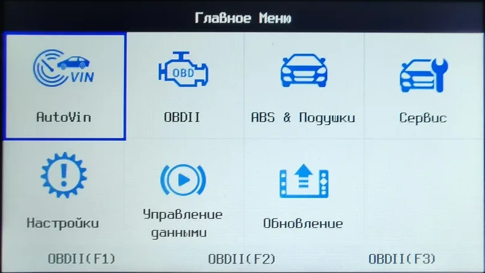

## Русские шрифты Foxwell NT680/NT680Lite/NT680Pro/NT650Elite
В стандартной поставке диагностического оборудования Foxwell качество руссификации оставляет желать лучшего. Шрифты очень широкие, неравномерные и буквы скачут относительно базовой линии.

В данном репозитории выкладываю подготовленные шрифты на базе open-source шрифтов Terminus. Устанавливаются простым копированием в корень карты памяти. 

 
